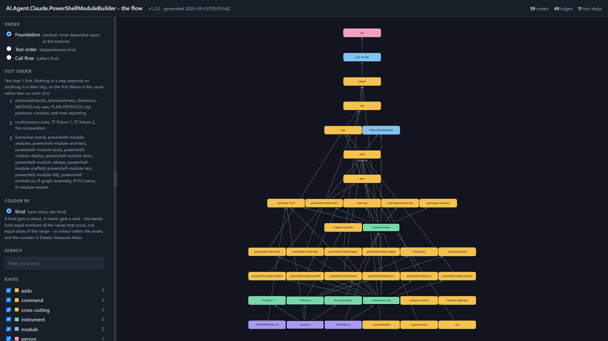

# AI.Agent.Claude.PowerShellModuleBuilder

[](https://github.com/JerryBalmer1/AI.Agent.Claude.PowerShellModuleBuilder/tags)
[](LICENSE)
[](https://learn.microsoft.com/powershell/)
[](docs/testing/README.md)

[](docs/diagram/flow.html)

<sup>**[`docs/diagram/flow.html`](docs/diagram/flow.html)**, opened in a browser
and photographed. Five layers, bottom to top, and nothing above exists until
the thing below it does. The layer colours and the wheel-zoom sensitivity are
**this repository eating its own dog food**: they are set through
PSGraphRenderToHtml's options surface, from one palette declared in
[`flow-graph.json`](docs/diagram/flow-graph.json), and the picture is taken by
PSGraphRender's own `tools/shoot.cjs`. Every producer this project ships tells
somebody else to work that way.
[What the diagram is, and the palette](docs/diagram/README.md).</sup>

A test-first harness that makes an AI coding agent's output **measurable**, and
the Claude Code plugin distilled from what the harness measured.

Two things live here, and the order matters. The harness came first: a
conformance suite, a hand-written oracle, and a scoring runner, all built and
falsified before any agent was asked to produce anything. The plugin —
`skills/` and `commands/` — is what the harness's findings hardened into.

The claim this repository exists to test is that the second measurably improves
the first's scores. **That claim has now been measured, four times, and the
answer is partly yes and partly no.** Both halves are below.

## How to read this repository's signals

Everything here that asks you to *do* something is marked, and the marks are a
system rather than decoration. Four of them are worth knowing before you read
anything else.

**Three circles say where a block of text goes.** Every prompt in
[`prompts/`](prompts/README.md) leads with one, and the word always rides the
circle so the colour is never carrying it alone:

| | | |
|---|---|---|
| 🔴 | **NEW SESSION** | `/clear` first, then paste it as message one. Nothing before it. |
| 🟢 | **SAME SESSION** | paste into the session already waiting. Do **not** `/clear`. |
| 🔵 | **NOT A PROMPT** | for you, the human. It is pasted nowhere. |

**A block without a circle is asked about, never guessed at.** Guessing costs a
`/clear` at best and a contaminated measurement at worst.

**`ENDS WITH:` is a tripwire.** A prompt states its own last line up front, so
you can see a truncated paste *before* you run it rather than three commands
later. Four deliveries were silently cut short before this existed
([UX-002](docs/ux/UX-002-ends-with-tripwire.md)).

**`## YOUR NEXT ACTION` is where a report stops talking.** Every pass report
ends with one plainly-stated action, or `none: hand this report to the
director.` A hard stop leads with `⛔ STOPPED — <why> — YOU NEED TO: <what>`
and puts the forensics underneath, so the thing you must do is never below the
evidence for why ([UX-003](docs/ux/UX-003-report-contract.md)).

**`LOCAL STATE` is the definition of done.** A pass ends by putting every
repository in the workspace back on `main`, clean, and printing a table saying
so. "Done" means **your editor already shows the result** — zero commands to
run first. A pass that ends without that table is not done, however finished the
prose above it reads ([UX-005](docs/ux/UX-005-local-handoff.md)).

**Squares mean layer.** 🟪 🟩 🟨 🟦 🟥 are the five layers of
[the diagram](#the-flow) — method, instruments, plugin, module, user — and the
[prompts kit](prompts/README.md#the-legend) narrows the same channel to the
three layers a *prompt* can belong to. The word beside the square says which
system, and 🟨 plugin is the same plugin in both.

The full legend is [in the kit](prompts/README.md#the-legend), stated once. Why
each convention exists, and what it cost to find out, is
[`docs/ux/`](docs/ux/README.md) — where a convention with no problem statement
is decoration and does not land.

---

<!-- TEMPLATE:replace — keep the shape of this section: prerequisites first,
     then the three commands, then how to remove it again. Swap the owner/repo
     slug, the marketplace name, the plugin name and the tag for your own. A
     new project's install section is the same shape with different nouns. -->

<!-- FENCE CONVENTION. Every code block in this file opens with ```<language>
     and closes with four backticks. The long closer is deliberate and it is
     load-bearing: CommonMark lets a closing fence be longer than its opener,
     and it means the only bare ``` line this file could ever contain is an
     UNTAGGED OPENER. plans/0041-operator-ux/accept.Tests.ps1 counts them and
     requires zero, so an untagged block cannot be added without turning a
     test red. A block whose language nobody declared is a block GitHub will
     not colour and a reader has to guess at. -->

## Install

**Check your prerequisites first.** One command, and it names anything missing
with the exact line that fixes it. Run it in your own shell, not inside Claude
Code:

```powershell
pwsh -NoProfile -File ./tools/publish/Test-Prerequisites.ps1
````

It checks five things: PowerShell 7.2 or later, Pester, InvokeBuild, git, and
`$env:AZDO_PAT`. All five count as missing if absent, and the PAT line says in
so many words that it is needed only by the three Azure DevOps skills and not to
build a module — so a missing PAT is a `1 of 5 missing` you can knowingly
ignore, not a mystery. The checker itself runs under Windows PowerShell 5.1 on
purpose: a prerequisite checker that will not start on the wrong PowerShell is
useless exactly when you need it.

Then paste these three inside **Claude Code**, not in a shell:

```text
/plugin marketplace add JerryBalmer1/AI.Agent.Claude.PowerShellModuleBuilder@v1.2.0
/plugin install psmodule@psmodule-builder
/psmodule:build
````

The first adds this repository as a plugin marketplace, **pinned to the
`v1.2.0` tag**. The pin is deliberate and is
[decision 0013](decisions/0013-harness-release-tagging.md): `main` moves as work
lands, and pinning means none of that reaches you until a release is tagged.
Drop the `@v1.2.0` and you are tracking whatever `main` happens to be, which is
not a release and is not what these measurements are about.

The second installs the plugin from that marketplace. The third is the plugin
doing something — run it in a PowerShell module repository and it builds to the
conventions the [skills](#the-skills) describe.

**There is no install script, and there never will be.** Nothing in this
repository asks you to pipe a URL into a shell — no `irm | iex`, no
`curl | bash`, no one-click button anywhere. Every install step above is a
command you can read before you run it, from a tree you can read before you
clone it, at a tag that cannot change under you. That is not caution about
this project's own scripts; it is that an install route nobody can audit is
indistinguishable from one nobody should trust, and a repository about
measuring what an agent actually did has no business shipping one.
[SECURITY.md](SECURITY.md) states the same thing as a standing rule, and the
release pass checks it.

**To remove it again:**

```text
/plugin uninstall psmodule@psmodule-builder
/plugin marketplace remove psmodule-builder
````

**Prefer to try it without touching anything public?**
[Chapter 9](docs/creating-an-agent/09-try-before-you-trust.md) stages the same
plugin as a local marketplace under `scratch/` and installs it from a path on
your own disk. Nothing is fetched and nothing is pushed.

**Before you install, read what this does and does not do.** The
[with/without table](#with-the-plugin-and-without-it) is the measured effect, and
the control run says it buys shape rather than correctness;
[Status, honestly](#status-honestly) is the list of what is still unproven,
including the fact that nobody has yet installed this cold on a machine that has
never cloned the repository.

<!-- TEMPLATE:replace — the shape of this section travels and its content does
     not. Keep the three parts: one diagram, a link map underneath it with a
     row per node, and a sentence saying which rendering is authoritative.
     Swap every node for your own. A diagram nobody can click through to the
     artifact behind it is decoration. -->

## The flow

**New here?** [Chapter 11 — your first module](docs/creating-an-agent/11-your-first-module.md)
walks this diagram end to end against the paste-able prompts in
[`prompts/`](prompts/README.md), which is where to start if you want a module
rather than a method.

Five layers, and the gravity is the argument: **nothing above exists until the
thing below it does.** The rules came first, the instruments were built and
falsified against those rules, the plugin is what the instruments' findings
hardened into, a module is what the plugin builds, and you are the only reason
any of it is worth the weight. Read it from the bottom.

The stages in the middle — `new → plan → build → test → tidy → release` — are
the path a module actually takes, and each names the skills it invokes **in
order**, saying where the order is real and where it is not.

**Legend — layer colors.** 🟪 method · 🟩 instruments · 🟨 plugin · 🟦 module ·
🟥 user. The same five are in [`flow.html`](docs/diagram/flow.html) and in the
[link map](#the-link-map) below, declared once in
[`flow-graph.json`](docs/diagram/flow-graph.json) and
[compared](plans/0041-operator-ux/Compare-Mermaid.ps1) rather than trusted. The
layer's **word** is on every subgraph title, because five hues at one lightness
are one colourblind reader away from carrying nothing.

```mermaid
%% The same graph as docs/diagram/flow-graph.json, mirrored here by hand.
%% flowchart BT reads bottom to top, and an arrow points from what comes first
%% to what follows it. The JSON states the same pairs the other way round -
%% dependent to dependency - because that is the direction its renderer reads.
%% Same edges, opposite orientation, one rule, stated in both files.
flowchart BT
  subgraph layer_method["1 · method and rules — everything rests on this"]
    method["METHOD.md"]
    plan-protocol["PLAN-PROTOCOL.md"]
    decisions["decisions/"]
  end

  subgraph layer_instruments["2 · the instruments — built and falsified before any capability"]
    conformance["conformance suite"]
    functional["functional oracle"]
    tf-fixture-1["TF fixture 1"]
    tf-fixture-2["TF fixture 2"]
    comparators["the comparators"]
  end

  subgraph layer_plugin["3 · the plugin — what the findings hardened into"]
    plugin["psmodule v1.2.0"]
    cmd-build["/psmodule:build"]
    cmd-test["/psmodule:test"]
    stage-new["new"]
    stage-plan["plan"]
    stage-build["build"]
    stage-test["test"]
    stage-tidy["tidy"]
    stage-release["release"]
    skill-plan["powershell-module-plan"]
    skill-architect["powershell-module-architect"]
    skill-scaffold["powershell-module-scaffold"]
    skill-build["powershell-module-build"]
    skill-docs["powershell-module-docs"]
    skill-ux["powershell-module-ux"]
    skill-analyzer["powershell-module-analyzer"]
    skill-test["powershell-module-test"]
    skill-tidy["powershell-module-tidy"]
    skill-deploy["powershell-module-deploy"]
    skill-release["powershell-module-release"]
    skill-azdo-rest["azdo-rest"]
    skill-azdo-yaml["azdo-pipeline-yaml-refs"]
    skill-azdo-graph["azdo-graph-assembly"]
    skill-tf-parse["tf-hcl-parse"]
    skill-tf-resolve["tf-module-resolve"]
    skill-tf-graph["tf-graph-assembly"]
    skill-producer-contract["producer-contract"]
    skill-task-tree["task-tree-reporting"]
  end

  subgraph layer_module["4 · what gets built"]
    module-yours["your module"]
    module-reference["PSAzureDevOpsGraph"]
  end

  subgraph layer_user["5 · who it is for"]
    you["you"]
  end

  method --> conformance
  method --> functional
  comparators --> functional
  decisions --> comparators
  decisions --> tf-fixture-1
  decisions --> tf-fixture-2

  conformance --> plugin
  functional --> plugin
  decisions --> plugin
  plan-protocol --> plugin

  conformance --> skill-architect
  conformance --> skill-scaffold
  conformance --> skill-build
  conformance --> skill-docs
  conformance --> skill-ux
  conformance --> skill-analyzer
  conformance --> skill-test
  conformance --> skill-tidy
  conformance --> skill-deploy
  conformance --> skill-release

  functional --> skill-plan
  functional --> skill-azdo-rest
  functional --> skill-azdo-yaml
  functional --> skill-azdo-graph

  tf-fixture-2 --> skill-tf-parse
  tf-fixture-2 --> skill-tf-resolve
  tf-fixture-2 --> skill-tf-graph

  stage-new -->|1| stage-plan
  stage-plan -->|2| stage-build
  stage-build -->|3| stage-test
  stage-test -->|4| stage-tidy
  stage-tidy -->|5| stage-release

  skill-plan --> stage-plan
  skill-architect --> stage-build
  skill-scaffold --> stage-build
  skill-build --> stage-build
  skill-docs --> stage-build
  skill-ux --> stage-build
  skill-analyzer --> stage-build
  skill-test --> stage-test
  skill-tidy --> stage-tidy
  skill-release --> stage-release
  skill-deploy --> stage-release

  cmd-build --> stage-build
  cmd-test --> stage-test

  stage-release --> module-yours
  stage-build --> module-reference
  conformance --> module-reference

  module-yours --> you

  %% ---- layer colours -------------------------------------------------
  %% The five hexes below are NOT chosen here. They are
  %% flow-graph.json meta.layerPalette, restated, and verify.ps1 parses
  %% both and compares them - because a colour copied by hand into a
  %% second file is a second source of truth that drifts silently.
  %% Light fills with near-black text so they read in both of GitHub's
  %% themes; the layer's WORD is on the subgraph title, because five
  %% hues at one lightness carry nothing on their own.
  classDef layerMethod fill:#A99BF2,stroke:#6E5FC7,stroke-width:1px,color:#0b0f14;
  classDef layerInstruments fill:#79D9A8,stroke:#3FA173,stroke-width:1px,color:#0b0f14;
  classDef layerPlugin fill:#F2C14E,stroke:#B78A12,stroke-width:1px,color:#0b0f14;
  classDef layerModule fill:#7FC4F2,stroke:#3F8CBF,stroke-width:1px,color:#0b0f14;
  classDef layerUser fill:#F2A0BE,stroke:#C05F84,stroke-width:1px,color:#0b0f14;

  class method,plan-protocol,decisions layerMethod;
  class conformance,functional,tf-fixture-1,tf-fixture-2,comparators layerInstruments;
  class plugin,cmd-build,cmd-test,stage-new,stage-plan,stage-build,stage-test layerPlugin;
  class stage-tidy,stage-release,skill-plan,skill-architect,skill-scaffold layerPlugin;
  class skill-build,skill-docs,skill-ux,skill-analyzer,skill-test,skill-tidy layerPlugin;
  class skill-deploy,skill-release,skill-azdo-rest,skill-azdo-yaml,skill-azdo-graph layerPlugin;
  class skill-tf-parse,skill-tf-resolve,skill-tf-graph,skill-producer-contract layerPlugin;
  class skill-task-tree layerPlugin;
  class module-yours,module-reference layerModule;
  class you layerUser;
````

Pan/zoom controls appear on the diagram's corner; for full control —
adjustable zoom, layer colors, the works —
[open `flow.html`](docs/diagram/flow.html) from a clone.
[Why one can be tuned and the other cannot](docs/diagram/README.md).

**Two nodes have no edges, and that is the finding rather than a drawing
error.** `producer-contract` and `task-tree-reporting` connect downward to
nothing, because **nothing in this repository grades them** — the battery that
grades the first lives in
[PSGraphRenderToHtml](https://github.com/JerryBalmer1/PSGraphRenderToHtml), and
the second is about the shape of a reply, which no oracle here reads. Every
other skill can be traced to an instrument that measured it.

**On clicking the diagram: don't.** GitHub renders Mermaid client-side inside a
cross-origin frame on `viewscreen.githubusercontent.com`, so a relative link in
a `click` directive resolves against that origin rather than this repository,
and whether an absolute one becomes a working link could not be observed from a
terminal. This was tested rather than assumed —
[the record](plans/0040-flow-docs/mermaid-click.txt) has the commands — and the
answer was *unproven*, so no `click` directive ships. **The link map below is
the navigation.**

### The link map

One row per node, the artifact behind it, and one line on what it does. If a
claim in the diagram looks wrong, this is how you get to the thing that settles
it. **Every row is generated from
[`flow-graph.json`](docs/diagram/flow-graph.json)** — the layer, the
description and the path are the node's own `scope`, `what` and `doc`
attributes, so a row cannot describe something the diagram does not.

The Layer cell links to [the palette](docs/diagram/README.md#the-layer-palette),
and its square is the same colour the node is drawn in. The word rides the
square: the square is the second channel, never the only one.

| Node | Layer | What it does | The artifact behind it |
|---|---|---|---|
| METHOD.md | [🟪 method](docs/diagram/README.md#the-layer-palette) | The method, with every rule marked PORTABLE, TUNE or DOMAIN | [method/METHOD.md](method/METHOD.md) |
| PLAN-PROTOCOL.md | [🟪 method](docs/diagram/README.md#the-layer-palette) | The pass format: sync, preconditions, red-first, per-task evidence, deviations, verify script, local handoff | [PLAN-PROTOCOL.md](PLAN-PROTOCOL.md) |
| decisions/ | [🟪 method](docs/diagram/README.md#the-layer-palette) | Fifteen append-only records, each settling one thing that kept being re-argued | [decisions/](decisions/) |
| conformance suite | [🟩 instruments](docs/diagram/README.md#the-layer-palette) | The shape oracle — 41 cases across Universal, Repository, HouseStyle and RequiresBuild | [evals/conformance/](evals/conformance/) |
| functional oracle | [🟩 instruments](docs/diagram/README.md#the-layer-palette) | A hand-written 49-node, 51-edge expected graph, a brief, a fixture and a seed | [evals/functional/](evals/functional/) |
| TF fixture 1 | [🟩 instruments](docs/diagram/README.md#the-layer-palette) | Three frozen repositories and a case list, frozen by decision 0011 and re-frozen by 0012 | [evals/tf/fixture/](evals/tf/fixture/) |
| TF fixture 2 | [🟩 instruments](docs/diagram/README.md#the-layer-palette) | Three more repositories, written mute — no case annotations anywhere in them | [evals/tf/fixture2/](evals/tf/fixture2/) |
| the comparators | [🟩 instruments](docs/diagram/README.md#the-layer-palette) | Compare-Graph.ps1 for Azure DevOps and evals/tf/Compare-TfGraph.ps1 for Terraform | [evals/functional/Compare-Graph.ps1](evals/functional/Compare-Graph.ps1) |
| psmodule v1.2.0 | [🟨 plugin](docs/diagram/README.md#the-layer-palette) | Nineteen skills and two commands, distilled from what the instruments measured | [.claude-plugin/plugin.json](.claude-plugin/plugin.json) |
| /psmodule:build | [🟨 plugin](docs/diagram/README.md#the-layer-palette) | Builds or extends a module to the house conventions | [commands/build.md](commands/build.md) |
| /psmodule:test | [🟨 plugin](docs/diagram/README.md#the-layer-palette) | The module's own build and the conformance suite, reported as two numbers | [commands/test.md](commands/test.md) |
| new | [🟨 plugin](docs/diagram/README.md#the-layer-palette) | Nothing has been decided yet, and that is the point | [prompts/first-module.md](prompts/first-module.md) |
| plan | [🟨 plugin](docs/diagram/README.md#the-layer-palette) | Six questions, then docs/PLAN.md in your repository with a definition of done | [skills/powershell-module-plan/SKILL.md](skills/powershell-module-plan/SKILL.md) |
| build | [🟨 plugin](docs/diagram/README.md#the-layer-palette) | Command surface, tree, manifest, build script, help, completers, analysis | [commands/build.md](commands/build.md) |
| test | [🟨 plugin](docs/diagram/README.md#the-layer-palette) | Manifest parses, files parse, module imports, unit, integration | [commands/test.md](commands/test.md) |
| tidy | [🟨 plugin](docs/diagram/README.md#the-layer-palette) | Naming, surface-versus-docs parity both ways, dead files, docs/PLAN.md currency | [skills/powershell-module-tidy/SKILL.md](skills/powershell-module-tidy/SKILL.md) |
| release | [🟨 plugin](docs/diagram/README.md#the-layer-palette) | Semver against the module surface, changelog, worklog, staging and output layout | [prompts/release.md](prompts/release.md) |
| powershell-module-plan | [🟨 plugin](docs/diagram/README.md#the-layer-palette) | A fixed six-question intake, a shorter delta set, and a plan file written into the target | [skills/powershell-module-plan/SKILL.md](skills/powershell-module-plan/SKILL.md) |
| powershell-module-architect | [🟨 plugin](docs/diagram/README.md#the-layer-palette) | Verb-noun, one command one question, when to split, Public versus Private | [skills/powershell-module-architect/SKILL.md](skills/powershell-module-architect/SKILL.md) |
| powershell-module-scaffold | [🟨 plugin](docs/diagram/README.md#the-layer-palette) | The exact tree the suite grades, plus the committed dev loader | [skills/powershell-module-scaffold/SKILL.md](skills/powershell-module-scaffold/SKILL.md) |
| powershell-module-build | [🟨 plugin](docs/diagram/README.md#the-layer-palette) | InvokeBuild tasks, ParseError in the analyzer severities, the coverage gate, exit-code discipline | [skills/powershell-module-build/SKILL.md](skills/powershell-module-build/SKILL.md) |
| powershell-module-docs | [🟨 plugin](docs/diagram/README.md#the-layer-palette) | Comment-based help, the house .EXAMPLE standard, about_ topics, the culture directory | [skills/powershell-module-docs/SKILL.md](skills/powershell-module-docs/SKILL.md) |
| powershell-module-ux | [🟨 plugin](docs/diagram/README.md#the-layer-palette) | When a parameter earns a completer, and which of the three mechanisms it earns | [skills/powershell-module-ux/SKILL.md](skills/powershell-module-ux/SKILL.md) |
| powershell-module-analyzer | [🟨 plugin](docs/diagram/README.md#the-layer-palette) | AST-driven analysis that never runs the code it reads | [skills/powershell-module-analyzer/SKILL.md](skills/powershell-module-analyzer/SKILL.md) |
| powershell-module-test | [🟨 plugin](docs/diagram/README.md#the-layer-palette) | The Pester 6 rules that bite, the five-layer runner, and zero cases is not a pass | [skills/powershell-module-test/SKILL.md](skills/powershell-module-test/SKILL.md) |
| powershell-module-tidy | [🟨 plugin](docs/diagram/README.md#the-layer-palette) | The pre-release sweep, and a refusal to bless a release with an open Bucket-A item | [skills/powershell-module-tidy/SKILL.md](skills/powershell-module-tidy/SKILL.md) |
| powershell-module-deploy | [🟨 plugin](docs/diagram/README.md#the-layer-palette) | Staging and output layout, and why Publish-Module is the operator's alone | [skills/powershell-module-deploy/SKILL.md](skills/powershell-module-deploy/SKILL.md) |
| powershell-module-release | [🟨 plugin](docs/diagram/README.md#the-layer-palette) | Semver against a module surface, changelog and worklog conventions | [skills/powershell-module-release/SKILL.md](skills/powershell-module-release/SKILL.md) |
| azdo-rest | [🟨 plugin](docs/diagram/README.md#the-layer-palette) | The Azure DevOps REST API, read-only | [skills/azdo-rest/SKILL.md](skills/azdo-rest/SKILL.md) |
| azdo-pipeline-yaml-refs | [🟨 plugin](docs/diagram/README.md#the-layer-palette) | Extracting and resolving references, with parsing separated from resolution | [skills/azdo-pipeline-yaml-refs/SKILL.md](skills/azdo-pipeline-yaml-refs/SKILL.md) |
| azdo-graph-assembly | [🟨 plugin](docs/diagram/README.md#the-layer-palette) | Identity by what a node is, never by where a traversal reached it | [skills/azdo-graph-assembly/SKILL.md](skills/azdo-graph-assembly/SKILL.md) |
| tf-hcl-parse | [🟨 plugin](docs/diagram/README.md#the-layer-palette) | Blocks rather than a whole-file regex, required_providers in both spellings, the raw expression text kept | [skills/tf-hcl-parse/SKILL.md](skills/tf-hcl-parse/SKILL.md) |
| tf-module-resolve | [🟨 plugin](docs/diagram/README.md#the-layer-palette) | The leading-dot guard, the double slash past the scheme, the unresolvable target as a flagged node | [skills/tf-module-resolve/SKILL.md](skills/tf-module-resolve/SKILL.md) |
| tf-graph-assembly | [🟨 plugin](docs/diagram/README.md#the-layer-palette) | Ids that carry their repository, containment from the directory tree rather than the calls, one fact as one edge | [skills/tf-graph-assembly/SKILL.md](skills/tf-graph-assembly/SKILL.md) |
| producer-contract | [🟨 plugin](docs/diagram/README.md#the-layer-palette) | Absent versus false, the consumer's battery, never renaming what the contract names | [skills/producer-contract/SKILL.md](skills/producer-contract/SKILL.md) |
| task-tree-reporting | [🟨 plugin](docs/diagram/README.md#the-layer-palette) | Response formatting during multi-skill work | [skills/task-tree-reporting/SKILL.md](skills/task-tree-reporting/SKILL.md) |
| your module | [🟦 module](docs/diagram/README.md#the-layer-palette) | What the flow produces: a conforming PowerShell module in your own repository | [docs/creating-an-agent/11-your-first-module.md](docs/creating-an-agent/11-your-first-module.md) |
| PSAzureDevOpsGraph | [🟦 module](docs/diagram/README.md#the-layer-palette) | A read-only Azure DevOps pipeline dependency grapher, built and scored five times | [runs/006-plugin-on/README.md](runs/006-plugin-on/README.md) |
| you | [🟥 user](docs/diagram/README.md#the-layer-palette) | The person the whole stack is pointed at. You enter at the `new` stage, with prompts/first-module.md. | [prompts/README.md](prompts/README.md) |

### Which rendering is authoritative

[`docs/diagram/flow-graph.json`](docs/diagram/flow-graph.json) is the source.
The Mermaid block above is a **hand-written mirror** of it, and the two are
compared by node count, ids, labels and layer membership in this pass's
[verify script](plans/0040-flow-docs/verify.ps1) — because a mirror nobody
diffs is a second source of truth that drifts silently.

[`docs/diagram/flow.html`](docs/diagram/flow.html) is the full-fidelity
version: the same graph, interactive, with every node's *who / what / why* and
the artifact path in its details panel. Open it from a clone —
`docs/diagram/flow.html` in a browser — rather than from GitHub, which serves
HTML as text.

It is regenerated by
[`tools/diagram/Build-Diagram.ps1`](tools/diagram/Build-Diagram.ps1), which
renders through
[PSGraphRenderToHtml](https://github.com/JerryBalmer1/PSGraphRenderToHtml) and
[PSGraphRender](https://github.com/JerryBalmer1/PSGraphRender) **at their
pinned tags**, `v0.1.0` and `v0.13.0`, materialised read-only with
`git archive` so that neither sibling repository is touched. **This is the
`producer-contract` skill eaten as dog food**: the graph above is validated
against a schema another repository owns, by that repository's own battery,
before it is allowed to render. Seven battery cases, green, on every build.

**A pass that changes the flow re-runs `Build-Diagram.ps1` and re-mirrors the
Mermaid.** Both, in the same commit. That obligation is recorded against
item 19 in [the LEDGER](LEDGER.md), which is where this project keeps work it
has accepted.

---

## Creating a new agent, start here:

Everything here was built by directing Claude, and the method is written down
so you can do the same thing on your own domain. Start at
[docs/creating-an-agent/00-start-here.md](docs/creating-an-agent/00-start-here.md)
— twelve chapters, each one worked against a real pass, run or decision in this
repository, including the mistakes.

**Why any of this, before how.** [Five laws, each mapped to the artifact that
embodies it](method/PHILOSOPHY.md) — the goal the method serves, and the
adjacent rabbit holes it declines by name.

**Deciding whether this much testing is worth it?**
[docs/testing/](docs/testing/README.md) explains what each layer of the stack
catches that the others do not, with the artifact behind every claim.

**Try it locally first.**
[Chapter 9](docs/creating-an-agent/09-try-before-you-trust.md) installs and
drives the plugin entirely on your own machine, and shows you how to remove it
again, before anything public is involved.

---

<!-- TEMPLATE:remove — every score below this line to the end of "The
     recurring findings" is a measurement of THIS agent against THIS
     fixture. A new project has taken no measurements, and a table of
     scores with the numbers blanked out invites filling them in with
     guesses. Delete the four sections; do not adapt them. -->

## With the plugin and without it

**What each instrument is, and what it catches that the others do not:
[docs/testing/](docs/testing/README.md).** Every number below was produced by
one of them, and every cell links the run record it came from.

Five blind runs against the same seed, the same brief, the same fixture and the
same oracle. Three with the plugin readable, and two with it unread — the second
of those given the same three-iteration budget as the plugin-on runs, which is
what makes it a control rather than a handicap.

**The headline, in one paragraph.** All four runs that were permitted to iterate
reached the functional oracle exactly — 12 / 12, zero differences — within two
fix iterations, and the control's first shot was the closest of the four. What
the plugin reliably supplies is first-shot conformance to house style, which is
not derivable from the brief: plugin-on runs scored 33 / 33 at first shot and
held it, while the control started at 19 / 33 and reached 28 / 33 only by
spending two of its three iterations on house conventions alone. On the evidence
so far the plugin buys shape, not correctness — and a single control cannot tell
us whether that is because the conventions are the hard part, or because the
dependency computation was never the hard part for this model.

| | [003](runs/003-baseline-off/) **off** | [004](runs/004-plugin-on/) **on** | [005](runs/005-plugin-on/) **on** | [006](runs/006-plugin-on/) **on** | [007](runs/007-baseline-iterated/) **off** |
|---|---|---|---|---|---|
| iterations allowed / used | 0 / — | ≤3 / 1 | ≤3 / 1 | ≤3 / **2** | ≤3 / **3** |
| build | exit 0 | exit 0 | exit 0 | exit 0 | exit 0 |
| **functional (first shot)** | **0 / 12** | **1 / 12** | **1 / 12** | **1 / 12** | **6 / 12** <sup>c</sup> |
| first-shot differences | 29 | 26 | 26 | 26 | **14** <sup>c</sup> |
| **functional (final)** | *never permitted* <sup>a</sup> | **12 / 12** | **12 / 12** | **12 / 12** | **12 / 12** |
| iterations to 12 / 12 | — | 1 | 1 | 2 | 1 |
| **conformance, first shot** | **19 / 33** | **33 / 33** | **33 / 33** | **33 / 33** | **19 / 33** <sup>d</sup> |
| **conformance, final** | *never permitted* <sup>a</sup> | **33 / 33** | **33 / 33** | **33 / 33** | **28 / 33** <sup>d</sup> |
| conformance, final, re-derived <sup>d</sup> | 19 / 33 | — | — | **33 / 33** | **32 / 33** |
| conformance cases-run (final) | 39 / 55 | 57 / 57 | 56 / 56 | 57 / 57 | 50 / 55 |
| Phase 1 wall clock | 32.6 min | 33 min | 23 min | 34 min | 181 min <sup>e</sup> |

Conformance is scored per assertion against `cases-defined`, the denominator
that does not move with the target's shape; `cases-run` is beside it because
[decision 0003](decisions/0003-score-comparability.md) requires both wherever
two scores are compared. Evidence for every cell: each run's `README.md`,
`conformance-result.json`, `compare-report.json` and `diff.txt`, in the
directories linked in the header row.

> **Every figure in this table is out of 33, and the suite is now out of 41.**
> `v1.2.0` added eight `HouseStyle` assertions — the help block — taking
> `cases-defined` from 33 to 41. **Scores before and after that tag are separate
> series and are not compared**, so nothing above is restated and nothing is
> re-derived; the table stands exactly as measured, on the 33-case series. For
> what the 41-case series looks like on a commit that predates it, run 006's
> final scores **38 / 41** with three declared Bucket-B failures, all in the new
> help assertions and none fixed:
> [`refscore.txt`](plans/0039-ux-help-batch/refscore.txt). The full derivation
> and per-tag split is
> [`denominator-v2.txt`](plans/0039-ux-help-batch/denominator-v2.txt); no
> existing assertion was weakened, renamed or removed.

**The caveats, each with the artifact that states it.** None of them is small
enough to leave in a footnote nobody reads, so they are here:

- <sup>a</sup> **Run 003 was never allowed a final score.** Its protocol said
  *"No fixes, no re-runs — the first scores stand"*
  ([plan 0020](plans/0020-baseline-off/plan.md)). The blank cells are a rule,
  not a failure. Run 007 exists to fill them.
- <sup>b</sup> **All five runs read a fixture that names its own cases.** The
  `ClaudeTesting` YAML carries comments identifying each case and stating what
  it is for. Reading the fixture through the module is what the task *is*, so
  every run has read them by design and always will — the fixture is frozen.
  **"Blind" in this project means the oracle, the prior run records and the
  plugin were unread. It has never meant the fixture was unread.**
  ([hazard 13](evals/HARNESS.md), and
  [run 007 findings C-3](runs/007-baseline-iterated/findings.md).)
- <sup>c</sup> **Run 007's first-shot functional figures are contaminated by its
  own prompt.** A measured run's prompt is inside its own read-allowlist, and
  this one named four convention mechanisms and their counts before the builder
  wrote a line. Three of the four recurred anyway; the fourth — the
  15-difference `repo`-on-`pipeline` mechanism — did not, and it is exactly the
  one a leak would most plausibly have prevented. **The 6 / 12 and the 14
  differences cannot be separated from "was told part of the answer", and the
  claim that the control's first shot was closest rests on them.** Run 006's
  prompt leaked the same list, weakening its first-shot number the same way.
  ([hazard 12](evals/HARNESS.md),
  [run 007 findings C-2](runs/007-baseline-iterated/findings.md),
  [run 006 record](runs/006-plugin-on/README.md).)
- <sup>d</sup> **The conformance scoring procedure was defective and is now
  fixed, so two numbers are printed.** Four assertions read the build output
  directory, which is gitignored; the protocol said "score from a fresh clone"
  and never said to build it. Run 007's conformance clone was not built, so it
  reported 28 / 33 where the same commit built first scores **32 / 33**. The
  ladder runs were unaffected — each had build output in its conformance tree by
  a different improvised route, which is why nobody noticed. Both runs' finals
  were re-cloned and re-scored under one procedure for the re-derived row, and
  run 007's first shot moves 19 / 33 → 20 / 33 the same way. The "as reported"
  rows are what each run measured under the rule as written; the re-derived row
  is the comparable one. ([rescore.txt](plans/0033-honest-headline/rescore.txt),
  [Score-Clone.ps1](evals/conformance/Score-Clone.ps1).)
- <sup>e</sup> **Wall clock is not comparable across the two protocols.** 181
  minutes against 23–34 is a run that spent two of its three iterations on house
  conventions the other three never had to think about, not a slower model.

### Where the plugin actually moved the number

**The full derivation is in [docs/testing/](docs/testing/README.md), and every
cell traces to a run record.** The functional score is dominated by one omitted
property, so it hides the result. The difference *breakdown* does not. All three plugin-on runs produced
**exactly the same 26 differences by the same four mechanisms**, so one column
covers them; run 007 is the control with the same budget.

| Mechanism | 003 off | 004 / 005 / 006 on | 007 off, iterated |
|---|---:|---:|---:|
| `repo` omitted from `pipeline` nodes | 15 | 15 | **0** |
| `alias` written where the oracle omits it | 8 | 8 | 8 |
| `reason` written as a bare token | 2 | 2 | 2 |
| `wrongEdgeTarget` — unresolved targets given colliding ids | 2 | **0** | 2 |
| `extraNode` — the empty repository emitted as a node | 1 | **0** | 1 |
| `extraEdge` — `checkout: self` turned into an edge | 1 | **0** | 1 |
| `missingNode` — `repo:consumer-app` | 0 | **1** | 0 |
| **total** | **29** | **26** | **14** |

Read across, that is the whole result:

- **The plugin fixes three behavioural errors at first shot, and the control
  fixes them in one iteration.** `checkout: self` produces nothing; a repository
  nothing references is not a node; an unresolved edge's target must not collide
  with a real node. Those are rules the skills state and the brief does not — so
  the plugin-on runs never made them. Run 007 made all three and had them fixed
  by iteration 1, along with everything else. **What the plugin buys here is the
  first shot, not the destination.**
- **The plugin changed nothing about the two output conventions** it does not
  state — `alias` and the `reason` format. Four blind sessions guessed, and all
  four guessed the same two things wrong in the same direction.
- **The plugin introduced one error of its own.** `azdo-graph-assembly` states
  the repository-node rule too narrowly, and every run that follows it exactly
  is missing one node. That is F-2, below.
- **The one mechanism the plugin-on runs share with 003 and 007 does not,**
  `repo` on `pipeline` nodes, is worth its own line: it cost 15 differences in
  four of the five runs and zero in run 007, which took it from one clause of
  the brief. Whether that is a better reading or a consequence of caveat
  <sup>c</sup> is not decidable from one run.
- **The measured, repeatable effect is shape: 19 / 33 → 33 / 33** at first shot,
  three times, from a fresh clone — about fourteen house-style assertions
  covering the build file, the generated psm1, one-function-per-file and the
  root files. Re-derived under the corrected procedure it is 20 / 33 → 33 / 33,
  thirteen assertions. Neither figure is derivable from the brief, and the
  control needed two of its three iterations to recover most of it.

**What five runs still cannot tell you.** Whether the conventions are the hard
part, or whether the dependency computation was never hard for this model. One
control, contaminated by its own prompt, against three runs of one instrument on
one fixture, is not enough to separate those, and this table does not pretend
otherwise. The next measurement worth taking is
[per-skill ablation](LEDGER.md) — which of the fourteen skills the ladder measured carries the
19 → 33 — not another run of the same shape.

---

## The variance across the three plugin runs

Runs 004 and 005 were **difference-for-difference identical**: the same 26
differences, the same four mechanisms at the same counts, the same 1 / 12 and
12 / 12, the same single iteration, zero structural edge errors each. Run 006
reproduced all of it. Every graded line matches across the three.

Two numbers move, and neither is a score:

- **`cases-run` 57 / 56 / 57.** Run 005 shipped no culture directory, so one
  assertion graded nothing and was reported skipped rather than passed. At
  `cases-run` the three runs are incomparable; at `cases-defined` they read 33,
  33 and 33. This is exactly what the stable denominator was for.
- **iterations 1 / 1 / 2.** Run 006's single iteration fixed the same four
  mechanisms and broke something else: the graph builder had branched on the
  *text* of the `reason` field, and improving that text produced the node id
  `yaml:/`. Same final answer, one extra step, and the fix was to split the
  machine-readable code from the human-readable message. See
  [F-12](runs/006-plugin-on/findings.md).

**F-5 is the one the instrument cannot see.** `powershell-module-build` says
`Requirements.psd1` is the only place dependencies are pinned, and two paragraphs
later says a runtime dependency belongs in the manifest. `powershell-yaml` is
honestly both. Run 004 read the first sentence and declared it in the manifest
alone; runs 005 and 006 read the second and declared it in both files. **All
three scored 33 / 33.** It is a real source-level disagreement between the three
builds that no assertion in the harness can detect, and it was predicted by run
004 before runs 005 and 006 existed.

---

## What a run costs

| | |
|---|---|
| Phase 1, blind build, plugin on | **23–34 minutes** (33, 23, 34 across runs 004–006) |
| Phase 1, blind build, plugin off, same budget | **181 minutes** (run 007) |
| Scoring, three jobs in parallel from three fresh clones | **~60 seconds**, twice — first shot and final |
| The live graph command against a 15-definition fixture | **9.8 s / 15.3 s / 10.7 s**, against a 5-minute cap |
| Iterations | 1–3, of 3 allowed |

Provenance sections in each run README. **The two Phase 1 figures are not one
measurement.** Run 007 spent two of its three iterations on house conventions
the plugin-on runs never had to think about; counting only to 12 / 12 functional
it used one iteration, like 004 and 005. Read the 181 as the cost of arriving
without the conventions, not as a slower model.

The scoring figures are likewise not comparable between runs 004/005 and 006 —
006 is slowest because it is the only one where every job both cloned fresh
*and* built from nothing. That was the right method and nothing said so, which
is why run 007's conformance clone was never built at all, and why the procedure
is now one script: [`Score-Clone.ps1`](evals/conformance/Score-Clone.ps1).

---

## The recurring findings

**Every row links its full text; the run records are
[004](runs/004-plugin-on/findings.md),
[005](runs/005-plugin-on/findings.md) and
[006](runs/006-plugin-on/findings.md), and a summary that does not link the
finding it summarises is prose.** Ten findings were recorded across runs 004
and 005. **Eight of the ten recurred
in run 006**, in a session that had not read either record. The two that did not
are the two that were never about the instrument. Full text:
[004](runs/004-plugin-on/findings.md),
[005](runs/005-plugin-on/findings.md),
[006](runs/006-plugin-on/findings.md).

| | What it is | 004 | 005 | 006 |
|---|---|---|---|---|
| **F-1** | the build skill's coverage-gate template **cannot fail** as shipped | ✔ | ✔ | ✔ |
| **F-2** | the repository-node rule, followed exactly, is short by one node | ✔ | ✔ | ✔ |
| **F-3** | the optional-field principle is contradicted by the schema it cites | ✔ | ✔ | ✔ |
| **F-4** | the `reason` format is stated nowhere | ✔ | ✔ | ✔ |
| **F-5** | the runtime-dependency fork — two readings, both defensible | ✔ | ✔ | ✔ |
| **F-6** | `/build` step 1 instructs a read the measurement forbids | ✔ | ✔ | ✔ |
| **F-7** | the `.GetNewClosure()` hazard | ✔ | ✔ | — |
| **F-8** | the Pester 6 assertion list cannot be written from memory | ✔ | ✔ | ✔ |
| **F-9** | the culture-directory skip | — | ✔ | — |
| **F-10** | a back-edge report that cannot tell a cycle from a diamond | — | ✔ | ✔ |

**F-1 is the most serious and it is in the plugin's own template.** Copied
faithfully, the `Test` task prints `Line coverage: 0% (target %)`, exits 0 and
grades nothing, because `Invoke-Pester` returns nothing without
`Run.PassThru` — so the gate compares `0 -lt $null` and never fires, and the
`PreTag` guard compares `($null + $null) -eq 0` and always fires. One missing
line, two dead gates, no symptom. Every run falsified its own gate afterwards and
watched it go red.

F-2, F-3, F-4 and F-5 are the four places the instrument is silent and the
producer must guess. Three independent sessions guessed identically. **That is
the strongest single result in this repository**: at fixed inputs the model is
repeatable to the difference, so a difference between runs is information about
the instrument, not noise.

---

<!-- TEMPLATE:replace — a reader of a templated copy still needs three
     paste-able commands in exactly this position. The script paths, the
     module name and the tag set are this project's; the shape is not. -->

## Running it

Needs PowerShell 7.2+, Pester 6.x, PSScriptAnalyzer, InvokeBuild. Three commands
reproduce a run end to end.

```powershell
# 1. Wipe the target back to the four-file seed. This is the start of a run.
./evals/functional/Reset-Target.ps1 -Destination scratch/runs/007-my-run

# 2. Shape. Read the score from result.json, never from the exit code — a red
#    conformance run is data, and the runner exits 0 on purpose.
#    Use -Command, never `pwsh -File`: -File flattens the comma-separated -Tag
#    into a single token and the filter then selects the wrong set, silently.
./evals/conformance/Invoke-Conformance.ps1 `
    -Path scratch/runs/007-my-run -ModuleName PSAzureDevOpsGraph `
    -Tag @('Universal','Repository','HouseStyle','RequiresBuild') `
    -ResultPath scratch/runs/007-my-run/conformance-result.json

# 3. Behaviour. Scores a produced graph against the hand-written oracle.
./evals/functional/Compare-Graph.ps1 `
    -CandidatePath scratch/runs/007-my-run/artifacts/graph.json `
    -ReportPath scratch/runs/007-my-run/compare-report.json
````

The fixture and the oracle also check each other, in both directions:

```powershell
Invoke-Pester ./evals/functional/Fixture.Tests.ps1     # 352 cases
Invoke-Pester ./evals/functional/ReadBack.Tests.ps1    #  76 cases, needs AZDO_PAT
Invoke-Pester ./evals/functional/Compare.Tests.ps1     #  28 cases
````

`-ModuleName` is optional. When the repository root is a run directory the runner
derives it from `src/<Name>/<Name>.psd1`; two manifests under `src/` is
undecidable and stops, naming both, rather than grading the wrong module silently.

---

<!-- TEMPLATE:replace — keep the section and the discipline. $env:AZDO_PAT,
     the read-only claim and the Azure DevOps coordinates are DOMAIN in
     method/METHOD.md's sense; the credential rule and the blind gate are
     PORTABLE and should survive re-nouning. -->

## Guardrails

**Credentials.** `$env:AZDO_PAT`, and nothing else, everywhere. Never a
parameter, never a file, never in a URL — a value passed as a parameter reaches
`PSReadLine` history, `Start-Transcript` output and the ScriptBlock logging event
log, and the token is a bearer credential for a whole organisation. Every run
scans its own artifacts, its clones and its tracked blobs for the PAT **by value**
before committing; all five runs report zero occurrences.

**Read-only, permanently.** The target module never queues, runs or triggers a
pipeline and never creates, updates or deletes anything. It is `GET` only, no
command is named with a writing verb, and both claims are asserted structurally
over the AST in a `PreTag` test rather than in prose.

**The blind gate.** A measured run is the first message of a fresh session, and a
session that has read anything under `runs/` is disqualified as a blind builder —
run records are oracle knowledge in prose. Nothing may write scores, fixture
findings or oracle content into session memory or any auto-loading file; a
context window is cleared, a memory file is not. Hazards 9–11 in
[evals/HARNESS.md](evals/HARNESS.md).

**Never edit the oracle to fit.** Run 006 found that `cases.md` justifies four
repository nodes with a rule that produces three. Nothing under `evals/` was
touched; it is recorded as a finding for a decision to repair.

**`main` moves only by fast-forward** after a green pass, ancestry checked, never
forced — [0009](decisions/0009-agent-moves-both-mains.md) for the target,
[0010](decisions/0010-ecosystem-repo-governance.md) for the rest.

---

<!-- TEMPLATE:remove — this section argues from this project's five runs.
     The argument is only as good as the measurements behind it, and a
     templated repository has none yet. Write it again at the end, from
     your own journal, the way pass 0029 wrote this one. -->

## Why not just prompt Claude to write a module?

You can, and it will produce something that looks right. The five runs above are
what happens when you then try to find out whether it *is* right.

- **Without the plugin, the module scored 19 / 33 on shape and emitted a node for
  a repository nothing references** — the empty repository sitting in the same
  project, which the naive implementation picks up from the repositories
  endpoint. Nothing about the output announces that. It reads as a complete
  graph, and it answers a different question from the one asked.
- **The conventions the brief does not state get guessed**, and four
  independent sessions guessed the same two things wrong in the same direction,
  plugin or no plugin. A prompt does not fix that; a scored oracle finds it in
  one run.
- **The gates you write to catch this are themselves usually broken.** F-1 is a
  coverage gate, copied from a skill, that could not fail. It was green on every
  build until somebody raised the threshold on purpose and watched it go red.
  An assertion that has only ever passed is indistinguishable from one that
  cannot fail.

The plugin is not the interesting artifact here — the measurement is. What this
repository provides is a way to state, with an artifact behind every number, what
an agent's output actually does: **33 / 33 on shape and 12 / 12 on behaviour, in
one or two iterations, at 23–34 minutes a run, reproducibly, three times.**

And equally, where it does not help. The control reached 12 / 12 too, in one
iteration, with the plugin unread — so on this fixture the plugin buys the shape
and the first shot, not the final answer. Two conventions it does not state were
guessed wrongly by every session, plugin or no plugin. **Knowing which half is
which is the thing that needed measuring, and it took a control run to find
out.**

---

<!-- TEMPLATE:replace — a plugin needs a table of what it contains and what
     each part is for. These nineteen names, their prefixes and the two
     findings noted against them are this project's. -->

## The skills

Named by scope, per [decision 0007](decisions/0007-skill-taxonomy-and-naming.md):
`powershell-module-<role>` for anything generic to building a PowerShell module,
`azdo-<role>` for what is specific to the Azure DevOps target, and — added at
v1.1.0 — `tf-<role>` for what is specific to reading Terraform configuration.
Dots are not legal in skill names, which rules out the `powershell.module.x`
form.

`producer-contract` fits neither prefix, and that is a gap in the taxonomy rather
than a naming slip: it is about emitting against a contract another repository
owns. Recorded for the operator to settle if a second cross-cutting skill appears.

**Every name below opens its `SKILL.md`.** Middle-click to open one in a new
tab and keep your place — that is your browser doing it, not this page. GitHub
strips `target` attributes from rendered Markdown, so no link here can open a
tab on its own, and saying so is better than a row of links that quietly do not
behave the way the sentence above them promised.

| Skill | Role |
|---|---|
| [`powershell-module-plan`](skills/powershell-module-plan/SKILL.md) | Intake and planning; a definition-of-done that names how the work will be tested before the work starts. |
| [`powershell-module-architect`](skills/powershell-module-architect/SKILL.md) | Command-surface design — verb-noun, one command one question, when to split, `Public/` versus `Private/`. |
| [`powershell-module-scaffold`](skills/powershell-module-scaffold/SKILL.md) | The layout the conformance suite grades: manifest, `Public/` flat, `Private/` nested, explicit exports, the committed dev loader. |
| [`powershell-module-build`](skills/powershell-module-build/SKILL.md) | `build.ps1` and `<Name>.build.ps1` — InvokeBuild tasks, `ParseError` in the analyzer severity list, the coverage gate, exit-code discipline. **Carries F-1.** |
| [`powershell-module-test`](skills/powershell-module-test/SKILL.md) | The Pester suite and the ordered five-layer runner that stops at the first failing layer. |
| [`powershell-module-analyzer`](skills/powershell-module-analyzer/SKILL.md) | AST-driven analysis that never runs the code it reads. |
| [`powershell-module-docs`](skills/powershell-module-docs/SKILL.md) | Comment-based help for public **and** private functions, the house `.EXAMPLE` standard, `about_` topics and the culture directory the build must copy. |
| [`powershell-module-ux`](skills/powershell-module-ux/SKILL.md) | Argument completion — when a parameter earns a completer, `ValidateSet` versus `[ArgumentCompleter]` versus `IArgumentCompleter`, the session cache and its guardrails. Added at v1.2.0. |
| [`powershell-module-tidy`](skills/powershell-module-tidy/SKILL.md) | The pre-release sweep — naming, surface/docs parity both ways, dead files, `docs/PLAN.md` currency, and a refusal to bless with an open Bucket-A item. Added at v1.2.0. |
| [`powershell-module-deploy`](skills/powershell-module-deploy/SKILL.md) | Staging and output layout; why `Publish-Module` is the operator's alone. |
| [`powershell-module-release`](skills/powershell-module-release/SKILL.md) | Semver against a module surface, changelog and worklog conventions. |
| [`azdo-rest`](skills/azdo-rest/SKILL.md) | The Azure DevOps REST API, read-only. `$env:AZDO_PAT` and nothing else, ever. |
| [`azdo-pipeline-yaml-refs`](skills/azdo-pipeline-yaml-refs/SKILL.md) | Extracting and resolving pipeline YAML references, parsing separated from resolution. |
| [`azdo-graph-assembly`](skills/azdo-graph-assembly/SKILL.md) | Turning references into a graph — identity by what a node is, never where a traversal reached it. **Carries F-2.** |
| [`tf-hcl-parse`](skills/tf-hcl-parse/SKILL.md) | Reading `.tf` as blocks rather than with a whole-file regex; `required_providers` in both its spellings; keeping an expression's raw text. |
| [`tf-module-resolve`](skills/tf-module-resolve/SKILL.md) | What a module `source` points at: the leading-dot guard, the `//` past the scheme, and the unresolvable target as a flagged node. |
| [`tf-graph-assembly`](skills/tf-graph-assembly/SKILL.md) | Ids that carry their repository, containment from the directory tree rather than the calls, and one fact as one edge. |
| [`producer-contract`](skills/producer-contract/SKILL.md) | Emitting against a schema another repository owns: absent versus false, the consumer's battery, never renaming what the contract names. |
| [`task-tree-reporting`](skills/task-tree-reporting/SKILL.md) | Response formatting during multi-skill work. |

The three `tf-*` skills were **deliberately withheld** from v1.0.x. They carry
what run tf-001 learned about the Terraform fixture it was scored against, and
writing them while that fixture was still the only Terraform instrument would
have measured the plugin's memory of tf-001 rather than its generality
([backlog 9](LEDGER.md)). They ship now because
[decision 0014](decisions/0014-second-unannotated-fixture.md) built a second
Terraform fixture that none of them was written against — a configuration
nothing in this repository had seen when these lines were drafted.

---

<!-- TEMPLATE:replace — a new project also has more than one repository and
     also needs one place saying which they are and which is governed from
     where. Swap the rows, keep the table. Everything from here to the end
     of the tf-001/tf-002 subsection is this project's content. -->

## The ecosystem

Six repositories, governed from here.

| Repository | What it is | State |
| --- | --- | --- |
| this one | the harness, the oracle, and the plugin distilled from what they measured | ladder complete at runs 004–006 |
| [PSAzureDevOpsGraph](https://github.com/JerryBalmer1/PSAzureDevOpsGraph) | the build target: a read-only AzDO pipeline dependency grapher | built and scored, runs 002–006 |
| [PSGraphRender](https://github.com/JerryBalmer1/PSGraphRender) | the renderer. Takes a view model, writes one self-contained HTML page, knows nothing about what the nodes are | v0.13.0, handed over |
| [PSGraphRenderToHtml](https://github.com/JerryBalmer1/PSGraphRenderToHtml) | the contract between a producer and the renderer, and the battery a producer runs against its own output | v0.1.0 |
| [PSModuleGraph](https://github.com/JerryBalmer1/PSModuleGraph) | the first producer, and the repository the renderer was extracted from | the renderer's first consumer |
| [PSTerraformGraph](https://github.com/JerryBalmer1/PSTerraformGraph) | the second producer, and the first that is not PowerShell | v0.2.0 |

### The cross-language measurement — tf-001, tf-002 and tf-003

The renderer's boundary is the claim the ecosystem exists to test: **a producer in
any language can drive it without changing it.**

[**tf-001**](runs/tf-001-first-build/) is where that stopped being an assertion.
PSTerraformGraph drives PSGraphRender through PSGraphRenderToHtml, over Terraform
HCL — a domain nobody had in mind when the renderer was extracted — and **not one
line of either changed to allow it.**

[**tf-002**](runs/tf-002-convention-and-case3/) re-scored it at **0 differences
and 7 / 7**, after the fixture's case 3 was repaired under
[decision 0012](decisions/0012-fixture-case3-repair.md) and two producer defects
were closed. The oracle was visible for both, so both are statements about one
fixture and **neither is a generalisation claim.**

### tf-003 — the blind run, and exactly what it licenses

[**tf-003**](runs/tf-003-generalisation/) is the first genuinely blind run in
this project: plugin v1.1.0 readable, a **second domain**, and an **unseen
fixture** — fixture 2 and its oracle, which the building session did not open
until its module was built and pushed. The fixture is written mute on purpose
([decision 0014](decisions/0014-second-unannotated-fixture.md)) and a standing
scanner is what keeps it that way, because pass 0033 had found fixture 1
annotating its own cases by name and by number.<sup>f</sup>

It came back **6 / 7 functional-tf at first shot with node and edge counts exact
— 99 / 99 and 88 / 88 — and 7 / 7 after one of its three permitted iterations**.
The 184 first-shot differences were **four naming conventions and not one
structural error**.<sup>g</sup> Every mechanism tf-001 lost a wave of edges to —
nested module resolution, both `required_providers` spellings, expression text,
a `git::` source with no `//` — was read correctly first time.

**That is not yet a generalisation result, and the reason is in the plugin.**
v1.1.0's three `tf-*` skills were written from tf-001 and tf-002 and cite their
findings by mechanism and by count, so the fixture was unseen but **the
mechanism catalogue was not** — which is the thing
[tf-002](runs/tf-002-convention-and-case3/) warned about when it left those
skills deliberately unwritten. What tf-003 establishes is that **a plugin
carrying a domain's recorded findings stops those findings recurring on an
unseen fixture in that domain.** That is worth having and it is a smaller claim.
Domain-independent generalisation is not measured here and needs a **third
domain or a plugin-off control** — one the `tf-*` skills say nothing about, or
this one run again with the plugin unread.

| | [tf-001](runs/tf-001-first-build/) | [tf-002](runs/tf-002-convention-and-case3/) | [tf-003](runs/tf-003-generalisation/) |
|---|---|---|---|
| fixture | fixture 1, **annotated** | fixture 1, **annotated** | fixture 2, **written mute** <sup>f</sup> |
| oracle | visible throughout | visible, and **amended by the pass** | **unread until the module was pushed** |
| plugin | v1.0.x, **no `tf-*` skills** | v1.0.x, **no `tf-*` skills** | v1.1.0, **three `tf-*` skills** <sup>h</sup> |
| first-shot differences | 94 | — <sup>i</sup> | **184** <sup>g</sup> |
| final differences | 31 | **0** | **0** |
| functional-tf, first shot | not scored separately | not scored separately | **6 / 7** |
| functional-tf, final | 6 / 7 | **7 / 7** | **7 / 7** |
| iterations used | 3 of 3 | — <sup>i</sup> | **1 of 3** |
| Phase 1 wall clock | ~55 min (whole run) | — <sup>i</sup> | **31 min** |

**The raw counts across these three do not compare, and the table is not an
invitation to try.** Different fixtures, different sizes, and a comparator that
has since gained a category. 184 > 94 says nothing: tf-001's 94 were twelve node
differences and forty-eight missing edges — *structure* — and tf-003's 184 were
four names. Compare the mechanisms, which is what the run record does.

- <sup>f</sup> **Fixture 2 says nothing about its own cases**, and that is
  enforced rather than intended: `evals/tf/Test-FixtureSanitization.ps1` is a
  standing gate that refuses a fixture file naming a case, the oracle, or a path
  into the harness. Fixture 1 fails it and is expected to — it is frozen and its
  bound is [disclosed, not repaired](plans/0033-honest-headline/tf-fixture-comments.txt).
  "Blind" here still means the oracle, the prior run records and the plugin were
  unread; for tf-003 it also means the fixture's case knowledge was, which is new.
- <sup>g</sup> **All 184 were four naming conventions**, and the node and edge
  counts were exact at first shot and never moved: `label`, `varType` versus
  `type`, `resolved`, and the unresolved-target id.
  ([findings](runs/tf-003-generalisation/findings.md) F-1 and F-2.)
- <sup>h</sup> **The `tf-*` skills are the bound, stated as a number.**
  `tf-hcl-parse` cites *"63 of that run's 94 differences"*; `producer-contract`
  states an asymmetry with *"28 differences"* beside it. Those are tf-001's and
  tf-002's counts, written into the plugin before tf-003 ran.
- <sup>i</sup> **tf-002 has no first-shot column** because it was not that kind
  of run: it re-scored an existing tagged build after a fixture repair and two
  defect fixes, rather than building from the seed. Its record states the same.

**Every functional-tf number above was re-derived at pass 0037**, from fresh
clones of tf-003's own commits, built, with the graphs regenerated from
read-only clones of the fixture repositories and scored by the promoted
`evals/tf/fixture2/Test-TfFixture2Case.ps1` — whose case 6 is *stricter* than
the scorer that first produced them. They did not move
([the rescore](plans/0037-consolidation/tf-003-rescore.txt), and
[the correction note](runs/tf-003-generalisation/README.md) appended to the run).

---

<!-- TEMPLATE:replace — the directory contract is worth keeping almost
     verbatim; only the evals/ rows describe a domain. -->

## Layout

| Path | What |
|---|---|
| [`skills/`](skills/) | The plugin's nineteen skills, one `SKILL.md` each |
| [`commands/`](commands/) | [`/build`](commands/build.md) and [`/test`](commands/test.md) |
| [`prompts/`](prompts/README.md) | The paste-able kit: five documents, and the signal legend |
| [`docs/creating-an-agent/`](docs/creating-an-agent/00-start-here.md) | Twelve chapters on the method, each worked against a real pass |
| [`docs/ux/`](docs/ux/README.md) | One numbered record per operator-experience convention: problem, why, evidence |
| [`docs/diagram/`](docs/diagram/README.md) | The flow graph's source, its interactive rendering, and the layer palette |
| [`docs/testing/`](docs/testing/README.md) | What each layer of the stack catches that the others do not |
| [`evals/conformance/`](evals/conformance/) | The shape oracle: `Conformance.Tests.ps1`, its runner, the falsification record |
| [`evals/functional/`](evals/functional/) | The behaviour oracle: `BRIEF.md`, `fixture/`, the comparator, the seed |
| [`evals/HARNESS.md`](evals/HARNESS.md) | What a run consists of, and the thirteen hazards |
| [`runs/`](runs/) | One directory per scored run, with its artifacts and transcripts |
| [`plans/`](plans/README.md) | One per pass: evidence per task, deviations, a verify script that re-derives the scores |
| [`journal/`](journal/) | Append-only, six fields per pass |
| [`decisions/`](decisions/) | Append-only decision records |
| [`method/`](method/METHOD.md) | The method, including its known limits |
| [`tools/`](tools/) | The prerequisite checker, the local publisher, and the diagram build |

---

<!-- TEMPLATE:remove — an honest status section is mandatory and its
     CONTENT cannot be inherited. Delete these bullets and write your own
     the first time you have something to be honest about. -->

## Status, honestly

- **The ladder is complete**: three consecutive blind plugin-on runs at a fixed
  seed, brief, plugin SHA and model version, each scored from fresh clones. Every
  graded line matches.
- **The plugin's effect is measured and it is uneven.** Large and repeatable on
  shape (19 / 33 → 33 / 33 at first shot). Nil on the converged functional
  score: all four runs allowed to iterate reached 12 / 12. Real but narrow on
  first-shot behaviour: three rules right immediately, one error introduced.
  **It buys shape, not correctness.**
- **The control now exists, and it closed the question the other way round.**
  Run 007 is plugin-off with the ladder's three-iteration budget. It reached
  12 / 12 in one iteration and its first shot was the closest of the five. What
  it could not do without the plugin is house style: 19 / 33, recovered to
  28 / 33 only by spending two more iterations on nothing else.
- **A single control cannot say why.** Whether the conventions are the hard part
  or the dependency computation was never hard for this model is not decidable
  from one run, and nothing here decides it.
- **The builder is the same model family that wrote the skills.** None of the
  five runs can separate reading the plugin from recalling the reasoning that
  produced it. What they measure is reliability at fixed inputs.
- **Two runs' prompts leaked oracle content into their own blind phases.** A
  measured run's prompt is inside its own read-allowlist. Run 006's named the
  prior runs' difference mechanisms and counts; run 007's did the same, and
  run 007's first-shot figures are the ones the headline comparison rests on.
  Both were flagged by the runs themselves, and both records say the first-shot
  independence is weakened. It is now
  [hazard 12](evals/HARNESS.md).
- **Every run has read a fixture that names its own cases**, because reading the
  fixture is the task. The fixture is frozen, so this is permanent and
  disclosed rather than fixable: "blind" here means the oracle, the run records
  and the plugin were unread. [Hazard 13](evals/HARNESS.md).
- **The conformance scoring procedure was wrong for one run and is fixed.**
  Four assertions read gitignored build output and the protocol never said to
  build the clone being scored. Run 007 reported 28 / 33 where the built commit
  scores 32 / 33; both affected runs were re-scored under one procedure. No
  assertion was changed.
  ([rescore.txt](plans/0033-honest-headline/rescore.txt).)
- The conformance suite is **falsified against one reference module**; eleven of
  twelve controls stay green and the twelfth is documented as failing.
- `Universal` has run against nine targets; **seven of nine assertions survive
  all nine**. The corpus control does not pass clean.
- The functional oracle covers **one** 15-pipeline fixture, and it contains a
  known contradiction (F-2) that no implementation following the stated rule can
  satisfy.
- Per-skill ablation — which of the fourteen skills the ladder measured carries the 19 → 33 — is
  **unmeasured**, and is the next question worth a run.
- **The Terraform fixture annotates its own cases too**, by name and by case
  number, and one of its READMEs points at the oracle document by path. It is
  frozen and nothing was changed; a **second** Terraform fixture was built
  written mute instead, with a standing scanner enforcing it, and that is what
  the blind run used.
  ([the scan](plans/0033-honest-headline/tf-fixture-comments.txt),
  [decision 0014](decisions/0014-second-unannotated-fixture.md).)
- **The blind run happened, and it does not say what it would be nice for it to
  say.** [tf-003](runs/tf-003-generalisation/) scored 6 / 7 at first shot and
  7 / 7 after one iteration against an unseen fixture, with zero structural
  errors. But v1.1.0's `tf-*` skills were written from tf-001 and tf-002 and
  cite their findings by count, so what is measured is a plugin preventing the
  recurrence of findings it already carries — **not** domain-independent
  generalisation, which needs a third domain or a plugin-off control. One run,
  one model, no control, and two fixtures built to the same case taxonomy.
- **Nothing in this repository has yet compared plugin-on with plugin-off on the
  Terraform line.** The whole with/without table is the Azure DevOps line. A
  tf-004 plugin-off control is written up as an operator decision in the
  [LEDGER](LEDGER.md) with its cost, and has not been taken.

<!-- TEMPLATE:replace — every project that becomes installable needs a
     versioning promise and a support statement, and both must be honest about
     what THIS maintainer can actually sustain. Keep both sections; rewrite the
     cadence, the scope of a major, and the contact route for your own. Do not
     inherit a cadence you have not agreed to. -->

## Versioning

Releases are tagged `vMAJOR.MINOR.PATCH`
([decision 0013](decisions/0013-harness-release-tagging.md)), and the tag is
what you install. The number on the tag and the `version` in
`.claude-plugin/plugin.json` always agree; if they ever disagree, that is a
defect, not a variant.

| | What may change | What you should do |
|---|---|---|
| **PATCH** — `1.0.x` | Corrected documents, clarified skill wording, fixed defects. Nothing changes what the plugin asks a builder to do. | Upgrade freely. |
| **MINOR** — `1.x.0` | New skills, new commands, new conventions. Existing conventions keep meaning what they meant. | Upgrade freely; read the [CHANGELOG](CHANGELOG.md) for what is new. |
| **MAJOR** — `x.0.0` | A skill removed or renamed, a command's contract changed, or a convention the conformance suite enforces **reversed**. Your existing use can break. | Read the CHANGELOG before upgrading. Modules built to the old conventions may stop conforming. |

**The pin is the promise.** Because you added the marketplace at a tag, none of
this reaches you until you change the tag. `main` moves whenever a pass lands —
that is work in progress, not a release, and pinning is what keeps the two
apart. To move to a later release, remove the marketplace and add it again at
the new tag.

**A caution about MAJOR.** This project's conventions are graded by a
conformance suite. A reversed convention does not merely change advice — it
changes what your module must look like to score. That is why it is a major, and
why the CHANGELOG will say so in those terms.

## Support

**This is a solo project.** One person, no team, no company behind it, no paid
tier and no service-level agreement. That is not a disclaimer added for form; it
is the single most useful thing to know before you depend on this.

**Issues:** <https://github.com/JerryBalmer1/AI.Agent.Claude.PowerShellModuleBuilder/issues>

**The cadence, stated so you can plan around it:** issues are read in batches,
roughly **weekly**. Security reports are looked at first — see
[SECURITY.md](SECURITY.md). Everything else is triaged when the batch is read,
and a reply may be "not planned", which is a real answer and is better than
silence. There is no on-call and there is no guaranteed response time. If you
need one, this project cannot give it to you.

**What a good bug report contains.** The audit commands are the same ones
[chapter 05](docs/creating-an-agent/05-calling-bullshit-verification.md) uses to
check any claim made in this repository, including the maintainer's. Run them
and paste the output — a report with them is actionable, a report without them
usually turns into three round-trips before anything can start:

```powershell
# 1. What you are running, exactly.
pwsh -NoProfile -Command '$PSVersionTable.PSVersion.ToString()'
pwsh -NoProfile -File ./tools/publish/Test-Prerequisites.ps1

# 2. Which version of the plugin, and whether it is the tagged one.
#    Run inside Claude Code:
#      /plugin
#    and report the version shown against psmodule.

# 3. If you cloned the repository, where its HEAD actually is.
git -C <your-clone> rev-parse HEAD
git -C <your-clone> describe --tags --always
git -C <your-clone> status --porcelain

# 4. The failure itself, re-run rather than remembered.
#    Paste the command you ran and its complete output, not a summary.
````

Then say **what you expected and what happened**, in that order, and separately.
The most common unactionable report is one that states a conclusion — "the build
skill is broken" — without the transcript that led to it. If a score or a count
is involved, say which command produced it: this repository's own rule is that a
number nobody re-derived is a claim, and that applies to reports as much as to
its own documents.

**Never paste a PAT, a token or an organisation URL into an issue.** If you
think you have leaked one, revoke it first and report second.

**What is most useful of all:** a cold-install report. Nobody has yet installed
this on a machine that has never cloned the repository. If you are the first,
say so and say what happened, and that is worth more than a bug report.

## Licence

MIT — see [LICENSE](LICENSE).

Copyright (c) 2026 Jerry Balmer. The licence file, the `license` field in
`.claude-plugin/plugin.json` and the entry in `.claude-plugin/marketplace.json`
all say MIT, and the release pass checks that they agree.
